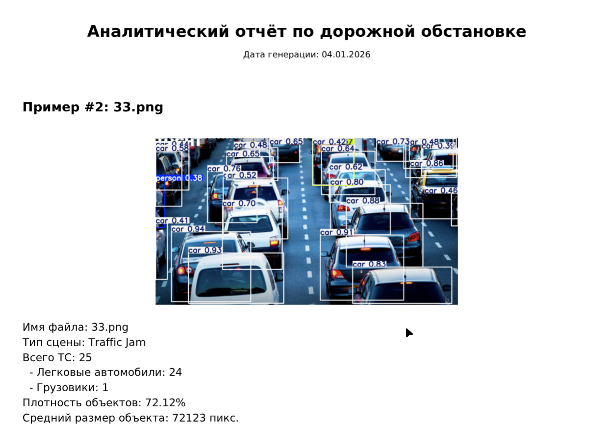

# StreetFlow Analyzer 🚗🚚

[](https://python.org)
[](https://pytorch.org)
[](https://ultralytics.com)
[](https://python-poetry.org)
[](https://pydantic.dev)
[](LICENSE)

**StreetFlow Analyzer** — An intelligent traffic analysis system powered by computer vision. Uses YOLOv8 for vehicle detection and generates comprehensive traffic analysis reports.


## 📋 Features

- 🔍 **Vehicle detection** (cars, trucks) with high accuracy
- 📊 **Traffic density analysis** across image zones
- ⚠️ **Congestion identification** and anomaly detection
- 📈 **Professional PDF report generation**
- 🧪 **Experiment mode** for testing and parameter tuning
- 📸 **Batch processing** of urban camera images
- 🚀 **GPU acceleration** support via PyTorch

## 🏗️ Project Structure

```
yolo_project/
├── data/                    # Input images directory
├── experiments/             # Experiment results and visualizations
├── report_output/           # Generated PDF reports
├── ttf/                    # Fonts for PDF generation
├── traffic_analyzer.py      # Main application script
├── pyproject.toml          # Poetry configuration
└── README.md               # Project documentation
```

## ⚙️ Installation

### Prerequisites
- Python 3.13+
- Poetry (dependency manager)
- Pydantic
- CUDA-capable GPU (optional, for faster inference)

### Quick Start

1. **Clone the repository:**
```bash
git clone https://github.com/yourusername/streetflow-analyzer.git
cd streetflow-analyzer
```

2. **Install Poetry (if not installed):**
```bash
curl -sSL https://install.python-poetry.org | python3 -
# or
pipx install poetry
```

3. **Install dependencies with Poetry:**
```bash
poetry install
```

4. **Activate the virtual environment:**
```bash
poetry shell
```

### Alternative: Manual Installation

If you prefer not to use Poetry:

```bash
# Create virtual environment
python -m venv venv
source venv/bin/activate  # Linux/Mac
# or
venv\Scripts\activate     # Windows

# Install dependencies...
...
```

## 🚀 Usage

### Basic Usage
Change THRESHOLDS and other constants in trffic_analyzer.py

```bash
# Generate traffic analysis PDF report
poetry run python traffic_analyzer.py report --conf 0.25
```

### Experiment Mode (Debug & Testing)

```bash
# Run in experiment mode to visualize detections in csv table
poetry run python traffic_analyzer.py experiment --conf 0.25
```

## 📈 Report Contents

Generated PDF reports include:

- **Executive Summary**: Key findings and alerts
- **Traffic Statistics**: Vehicle counts by type and zone
- **Density Heatmaps**: Visual representation of traffic density
- **Time-based Analysis**: Traffic patterns over time
- **Anomaly Detection**: Identified congestion points
- **Recommendations**: Traffic management suggestions
- **Technical Details**: Processing parameters and metrics

## 🧪 Technical Implementation

### Core Features

- **Adaptive Preprocessing**: Handles various lighting and weather conditions
- **Zone-based Analysis**: Divides images into regions for localized analysis
- **False Positive Filtering**: Spatial relationship analysis to reduce errors
- **Performance Optimization**: Batch processing and GPU acceleration
- **Modular Architecture**: Easy to extend and customize

### Model Configuration

```python
# Example model configuration change name for constant
# using YOLO from ultralytics
MODEL_NAME = 'yolov8n.pt'  # nano version for speed
# Alternatives: yolov8s.pt, yolov8m.pt, yolov8l.pt, yolov8x.pt
```

## 🤝 Contributing

We welcome contributions! Here's how you can help:

1. **Report Bugs**: Open an issue with detailed reproduction steps
2. **Suggest Features**: Share your ideas for improvements
3. **Submit Pull Requests**:
   - Fork the repository
   - Create a feature branch
   - Add tests for new functionality
   - Ensure code follows PEP 8 guidelines
   - Update documentation as needed

### Contribution Guidelines

- Write clear, commented code
- Add tests for new features
- Update documentation
- Follow existing code style
- Keep pull requests focused on single features

## 📄 License

This project is licensed under the MIT License - see the [LICENSE](LICENSE) file for details.

## ✨ Authors

- **[Ollldman]** - Lead Developer & Researcher
- **Ultralytics Team** - YOLOv8 framework
- **Contributors** - Everyone who helped improve this project

## 🙏 Acknowledgments

- **Ultralytics** for the amazing YOLOv8 framework
- **PyTorch Team** for the deep learning framework
- **OpenCV Community** for computer vision tools
- **All Open-Source Contributors** who made this possible

## 📚 Resources

- [YOLOv8 Documentation](https://docs.ultralytics.com/)
- [PyTorch Tutorials](https://pytorch.org/tutorials/)
- [OpenCV Documentation](https://docs.opencv.org/)
- [Poetry Documentation](https://python-poetry.org/docs/)

## 🔗 Related Projects

- [YOLOv8 Official Repository](https://github.com/ultralytics/ultralytics)
- [Traffic Monitoring Systems](https://github.com/topics/traffic-analysis)
- [Computer Vision Utilities](https://github.com/topics/computer-vision)

---

⭐ **If you find this project useful, please give it a star on GitHub!**

---

**Need Help?** Open an issue or start a discussion in the repository. We're here to help!

**Found a Bug?** Please report it with detailed steps to reproduce.

**Want to Collaborate?** Check out the open issues or propose new features!
